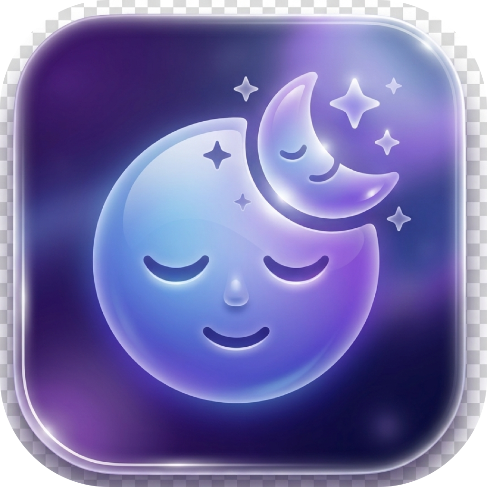
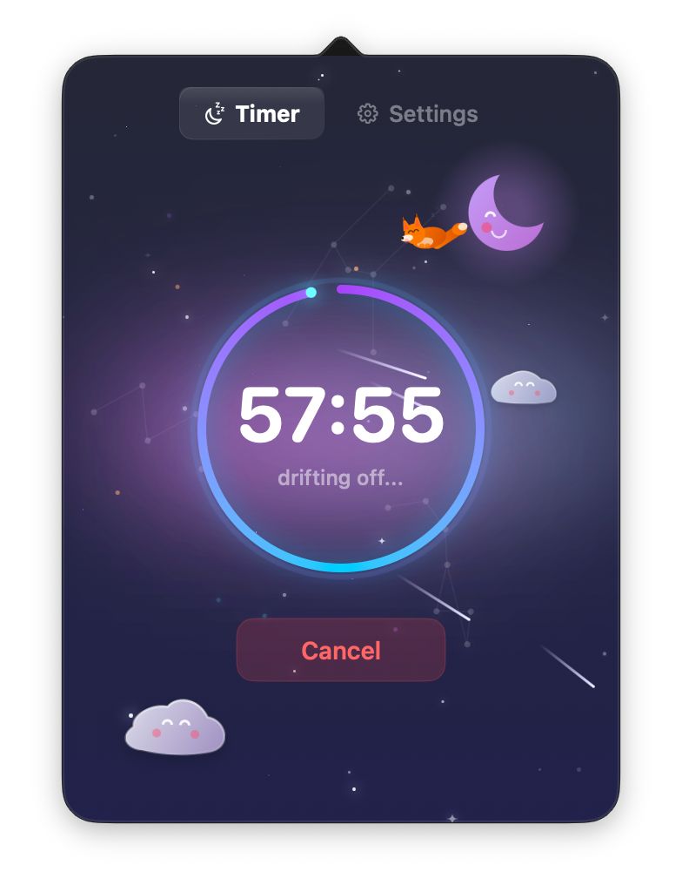

<div align="center">
  
  <h1>Slumber 🌙✨</h1>
  <p><b>An aesthetic macOS menu bar sleep timer with vector graphics, companion animations, and P3 wide-gamut visuals.</b></p>

  [](LICENSE)
  []()
  []()
</div>

---

## 🌟 Overview

**Slumber** is an ambient, minimalist menu bar application for macOS. Built with native Swift and SwiftUI, it puts your Mac to sleep after a customizable countdown timer while providing a relaxing visual experience.

Slumber features a Display P3 wide-gamut cosmic sky, soft vector clouds, dynamic shooting stars, and orbiting **animal companions** (like the sleeping fox and purple kitten) that accompany you as you drift off to sleep.

---

## 📸 Screenshots & UI

<div align="center">
  
  <br/>
  <em>(Experience peaceful bedtime timers right from your macOS menu bar!)</em>
</div>

---

## 📝 Recent Changes (v2.7)

- **🎨 App Icon Pipeline Overhaul**:
  - Processed `Assets/New_Icon.icon` artwork into a 1024x1024 full-bleed canvas (`fullbleed_icon.png`).
  - Allowed native macOS system squircle masking to render clean, smooth corners with **zero double-borders or white ring artifacts**.
  - Generated multi-resolution `AppIcon.icns` (`16x16` through `512x512@2x`).
  - Added automatic LaunchServices registration (`lsregister`) and Finder/Dock icon cache invalidation (`qlmanage -r cache`, `killall Dock`, `killall Finder`) in `build.sh`.

- **⚙️ Preferences & Version Sync**:
  - Bumped app bundle version to **v2.7** in `Info.plist` (`CFBundleShortVersionString` and `CFBundleVersion`) and updated Preferences view footer text (`Slumber v2.7`).
  - Cleaned up Preferences page layout (removed in-app icon reflection from Preferences header).

- **🔇 Audio & Quit Experience**:
  - Removed unwanted `cancel.wav` sound trigger on app termination (`QuitButton` now quits immediately and silently).

- **🛠️ SwiftPM & Build Integrity**:
  - Added root exclude list (`build.sh`, `README.md`, `LICENSE`) in [Package.swift](file:///Users/marspater/Projects/Sleeper/Package.swift) to resolve Xcode Analyze membership errors.
  - Standardized target deployment to `macos14.0`.

---

## ✨ Features & Architecture

### 🎨 1. Beautiful Vector Graphics Engine
- Pure SwiftUI vector path shapes for clouds, twinkling stars, and cosmic auroras.
- Display P3 wide-gamut color definitions (`Color.p3(...)`) for vibrant colors across both Light & Dark OS themes.

### 🦊 2. Animated Animal Companions
- **Sleeping Fox & Kitten**: Interactive companions resting on soft clouds during idle state, smoothly transitioning to orbit around the sleeping moon when a countdown starts.
- **Keplerian Orbital Motion & Physics**: Continuous wall-clock time math using `TimelineView` for smooth floating, breathing sine-wave motions, and spring-interpolated position lerping.

### 🖥️ 3. Native macOS Support
- Native `.icon` bundle format support (`New_Icon.icon`) with full-bleed squircle rendering and zero white borders.
- Display parameter change listener for SDR & HDR display adaptation.
- System wake notifications automatically cancel pending timers if the Mac is opened.

### 🎵 4. Soft Ambient Bedtime Audio
- Synthesized low-volume sine-wave audio cues for timer start and button presses.

---

## 🚀 Installation & Building

### Prerequisites
- **macOS 14.0** or later.
- Xcode Command Line Tools (`swiftc`).

### 1-Click Build & Install

1. **Clone the repository:**
   ```bash
   git clone https://github.com/marspater/Slumber.git
   cd Slumber
   ```

2. **Build & install:**
   ```bash
   chmod +x build.sh
   ./build.sh
   cp -R Slumber.app /Applications/
   ```

3. **Launch Slumber:**
   ```bash
   open /Applications/Slumber.app
   ```

---

## 📄 License

Slumber is open-source software licensed under the **[GNU General Public License v3.0 (GPL-3.0)](LICENSE)**.

---

## 👤 Author

Developed with ❤️ by **Mars Pater** ([@marspater](https://github.com/marspater)).
