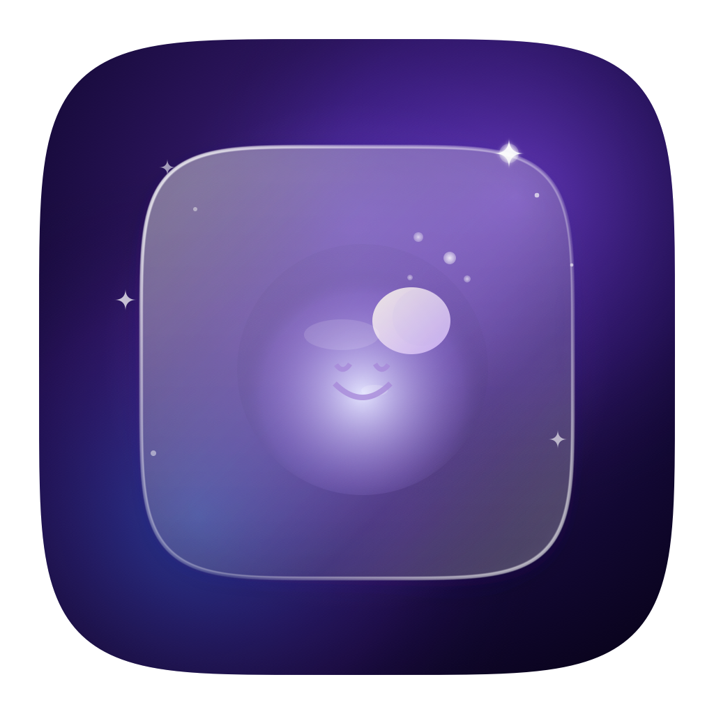

<div align="center">
  
  <h1>Slumber 🌙✨</h1>
  <p><b>An elegant, aesthetic macOS menu bar sleep timer for macOS 27+</b></p>
</div>

---

## 🌟 Overview

**Slumber** is a minimalist menu bar utility designed to put your Mac to sleep after a customizable countdown timer. Featuring a beautiful wide-gamut Display P3 dynamic starfield background, ambient soft sound effects, and a global hotkey, Slumber ensures your device sleeps beautifully.

With our latest overhaul for **macOS 27**, we've integrated Apple's continuous corner curvature (n=5 superellipse), vibrant dark mode popover materials, and extremely soft ambient audio, crafting an intuitive and premium experience.

---

## 📸 Screenshot

<div align="center">
  
  <br/>
  <em>(Experience the dynamic cosmic nebula right from your menu bar!)</em>
</div>

---

## ✨ Features

- 🕒 **Custom Sleep Countdown**: Quick duration chips (15m, 30m, 45m, 60m) or precise slider inputs.
- 🌌 **Cosmic Aesthetic UI**: Twinkling starfield with vector clouds, a sleeping moon, and interactive visual feedback.
- 🎵 **Ambient Audio**: Extremely soft, ambient sine-wave sounds for a calming bedtime experience.
- 🛡️ **Wake Protection**: Automatically cancels timers if you wake the Mac, preventing unexpected shutdowns.
- ⚡ **Global Hotkey**: Press `Ctrl + Option + S` to toggle the Slumber popover anywhere.
- 🍏 **macOS 27 Native**: Beautiful glass materials, Apple standard typography (SF Pro), and continuous superellipse corners.

---

## 🚀 Easy Installation & Building

No complex Xcode setups required! 

### Prerequisites
- **macOS 27.0** or later
- Swift Command Line Tools

### 1-Click Build

1. **Clone the repository:**
   ```bash
   git clone https://github.com/marspater/Slumber.git
   cd Slumber
   ```
2. **Build the app:**
   ```bash
   ./build.sh
   ```
   *This single command compiles the Swift package and builds the `.app` bundle with the vector icons!*

3. **Run Slumber:**
   ```bash
   open Slumber.app
   ```
   *(Or drag `Slumber.app` to your `/Applications` folder for easy access!)*

---

## 🛠 Tech Stack

- **Language**: Swift 6
- **UI Frameworks**: SwiftUI & AppKit
- **System APIs**: `Carbon` (Global Hotkeys), `AVFoundation`, `ProcessInfo`, `pmset`

---

## 👤 Author

Developed with ❤️ by **Mars Pater** ([@marspater](https://github.com/marspater)).
