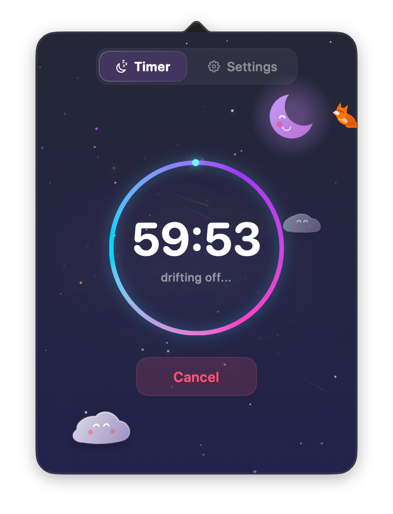

<div align="center">
  
  <h1>Slumber 🌙✨</h1>
  <p><b>An aesthetic macOS menu bar sleep timer with vector graphics, companion animations, Display P3 wide-gamut & native EDR/HDR rendering.</b></p>

  [](LICENSE)
  []()
  []()
  [](https://github.com/marspater/Slumber/tags)
  [](https://github.com/marspater/Slumber/raw/main/Slumber.zip)
</div>

---

## 🌟 Overview

**Slumber** is an ambient, minimalist menu bar application for macOS. Built with native Swift 6 and SwiftUI, it puts your Mac to sleep after a customizable countdown timer while providing a relaxing visual experience.

Slumber features a **Display P3 + EDR** wide-gamut cosmic sky, soft vector clouds, dynamic shooting stars, and orbiting **animal companions** (the sleeping fox, purple kitten, and sleeping dodo bird) that somersault and float around the moon in zero-gravity as you drift off to sleep.

---

## 📦 Download & Quick Install

### Option 1: Direct Download (Signed & Verified)
1. Download **[Slumber.zip (v3.0)](https://github.com/marspater/Slumber/raw/main/Slumber.zip)**.
2. Unzip and move `Slumber.app` to your `/Applications` folder:
   ```bash
   # Quick one-liner to download, install and remove download quarantine:
   curl -L -o /tmp/Slumber.zip "https://github.com/marspater/Slumber/raw/main/Slumber.zip" && unzip -q /tmp/Slumber.zip -d /Applications/ && xattr -cr /Applications/Slumber.app
   ```
3. Open Slumber from Spotlight or Launchpad!

### Option 2: Build from Source
```bash
git clone https://github.com/marspater/Slumber.git
cd Slumber
chmod +x build.sh
./build.sh
cp -R Slumber.app /Applications/
open /Applications/Slumber.app
```

---

## 📝 Recent Changes (v3.0)

- **🌌 Display P3 + Semantic EDR/HDR Pipeline**:
  - Root view dynamic range enabled via `.allowedDynamicRange(.high)`.
  - Semantic headroom design tiers (`HDRLevel`):
    - `.sdr` (`1.0×`): Sky background, companion fur/body, native UI controls, text.
    - `.rimHighlight` (`1.1×`): Moonlit cloud rims, companion alert eye glints.
    - `.subtleHighlight` (`1.25×`): Aurora ambient washes, timer progress ring glow, active slider thumb.
    - `.visibleGlow` (`1.75×`): Firefly resting glow, outer moon halo.
    - `.strongGlow` (`2.25×`): Inner moon crescent core.
    - `.effect` (`3.0×`): Firefly peak twinkle, shooting star flash.
  - Continuous linear headroom interpolation (`Color.p3(..., headroomBetween:and:phase:)`) for silky smooth 60/120 fps firefly twinkles and shooting star trails.
  - Automatic display capability detection (`DisplayHeadroom.supportsEDR`) with graceful SDR fallback on non-HDR external monitors.

- **🏗️ Modular Architecture (`SlumberCore`)**:
  - Decoupled business logic and timer state into standalone `SlumberCore` module.
  - Comprehensive 12-test deterministic test suite powered by injectable `@MainActor MockClock`.

- **⏱️ Smart Wake Resumption**:
  - When your Mac wakes while a timer is active, Slumber recalculates the exact remaining time from the stored deadline and resumes the countdown seamlessly.

- **🪟 Non-Shifting Error Banner Overlay & Retry UX**:
  - Converted error reporting into a floating frosted glass overlay, keeping the countdown dial and controls perfectly anchored without layout shifts.
  - Added one-click **Retry** button for immediate recovery if sleep dispatch is blocked.

- **🎨 Apple Icon Composer Pipeline (macOS 26.0+)**:
  - Direct compilation of canonical `Assets/AppIcon.icon` into `Assets.car` via `actool` targeting modern macOS 26.0+ wide-gamut Display P3 displays.

- **🦤 3rd Companion: Sleeping Dodo Bird**:
  - Added the **Sleeping Dodo** (`SleepingDodo`) with celestial turquoise plumage, hooked amber beak, and sleepy `"zzz"` particles.
  - The app randomly selects from all 3 companions (**Fox**, **Cat**, **Dodo**) on launch and timer start.

- **🛰️ Zero-Gravity 360° Space Somersault & Floating Physics**:
  - Orbiting companions perform continuous, playful 360° axial somersaults and Lissajous floating micro-drifts.

- **💎 UI Polish & Refined Tokens**:
  - Enhanced slider track & thumb proportions with P3 glow.
  - Improved preset chip contrast and spacing.
  - Frosted glass keycap badge (`[ ⌃⌥S ]`) for the global hotkey.

---

## ✨ Features & Architecture

### 🎨 1. Display P3 + EDR Graphics Engine
- Pure SwiftUI vector path shapes for clouds, twinkling stars, and cosmic auroras.
- Display P3 wide-gamut color definitions with Apple native `.headroom(_:)` integration.
- Context-aware EDR scaling preserving high contrast between dim backgrounds and glowing celestial lights.

### 🦊 2. Animated Animal Companions
- **Sleeping Fox, Kitten & Dodo**: Interactive companions resting on soft clouds during idle state, smoothly transitioning to orbit and somersault around the sleeping moon when a countdown starts.
- **Keplerian Orbital Motion & Zero-G Physics**: Continuous wall-clock time math using `TimelineView` for zero-g floating, breathing sine-wave motions, and spring-interpolated position lerping.

### 🖥️ 3. Native macOS Support
- Native `.icon` bundle format support (`Assets/AppIcon.icon`) compiled directly with Apple `actool` into `Assets.car`.
- System wake notifications gracefully communicate state transitions if the Mac is opened.
- Native macOS `Toggle` switch style with system accessibility.

### 🎵 4. Soft Ambient Bedtime Audio
- Synthesized low-volume sine-wave audio cues for timer start, preset selection, and button presses.

---

## 📄 License

Slumber is open-source software licensed under the **[GNU General Public License v3.0 (GPL-3.0)](LICENSE)**.

---

## 👤 Author

Developed with ❤️ by **Mars Pater** ([@marspater](https://github.com/marspater)).
