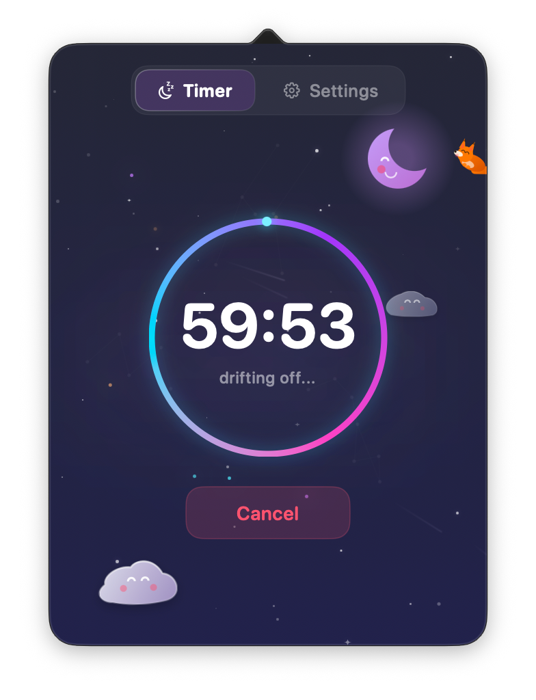

<div align="center">
  

  # Slumber 🌙

  **A native macOS menu bar sleep timer built with Swift 6 and SwiftUI, with Display P3 color, EDR highlights, vector artwork, and animated companions.**

  [](https://github.com/marspater/Slumber/actions/workflows/swift.yml)
  [](https://github.com/marspater/Slumber/actions/workflows/codeql.yml)
  []()
  []()
  [](https://github.com/marspater/Slumber/tags)
  [](LICENSE)
</div>

## What it does

Slumber lives in the macOS menu bar and puts the Mac to sleep after a configurable countdown. The UI is intentionally compact, native, and lightweight while still being mildly excessive about moonlight.

### Highlights

- Native Swift 6 + SwiftUI/AppKit menu bar app.
- 1–120 minute countdown with presets and keyboard control.
- Display P3 color with EDR brightness tiers and system tone mapping on displays without headroom.
- Vector moon, clouds, fox, cat, and dodo artwork with Reduce Motion support.
- Global `⌃⌥S` shortcut with conflict detection.
- Deadline-based timer logic that handles wake events without immediately putting the Mac back to sleep after a missed deadline.
- IOKit sleep request with an AppleScript fallback.
- Automated Swift CI and CodeQL security scanning.

## Requirements

- macOS 26.0 or later.
- Xcode / Apple command-line developer tools when building from source.

## Download

The current packaged build is tracked as [`Slumber.zip`](Slumber.zip).

1. Download and unzip `Slumber.zip`.
2. Move `Slumber.app` to `/Applications`.
3. Open Slumber from Finder, Spotlight, or Launchpad.

The tracked build is not notarized, so macOS may require an explicit first-launch approval. If you prefer not to use a prebuilt artifact, build from source instead.

## Build from source

```bash
git clone https://github.com/marspater/Slumber.git
cd Slumber
swift test
chmod +x build.sh
./build.sh --install
```

Useful build options:

- `./build.sh` builds `.build/artifacts/Slumber.app`.
- `./build.sh --install` also installs it to `/Applications`.
- `./build.sh --package` refreshes the tracked `Slumber.zip`.

When a Developer ID signing identity is available, the build script prefers it. Otherwise it falls back to ad-hoc signing.

## Repository layout

| Path | Purpose |
| --- | --- |
| `Sources/SlumberCore` | Timer/domain logic and sleep integration |
| `Sources/Slumber` | SwiftUI/AppKit UI, menu bar integration, art, and theme |
| `Sources/Slumber/Theme` | Central design tokens, P3/EDR levels, component and art specs |
| `Tests/SlumberTests` | XCTest coverage for core behavior and vector parsing |
| `Assets` | Icon Composer source, screenshot, and audio assets |
| `docs/DESIGN.md` | Design system and artwork reference |
| `.github/workflows` | CI and CodeQL workflows |

## Development

Run the standard validation sequence on macOS:

```bash
swift package describe
swift test
swift build -c release
./build.sh
```

See [`AGENTS.md`](AGENTS.md) for repository-specific engineering rules and [`docs/DESIGN.md`](docs/DESIGN.md) for the visual system.

## Changes

The latest work on `main` is documented in [`CHANGELOG.md`](CHANGELOG.md). The current source tree contains additional post-v3.2 changes, so the changelog is the better place to inspect what moved instead of embalming old implementation details in this README.

## License

Copyright © 2026 Mars Pater.

Slumber is licensed under the [GNU General Public License v3.0](LICENSE).
